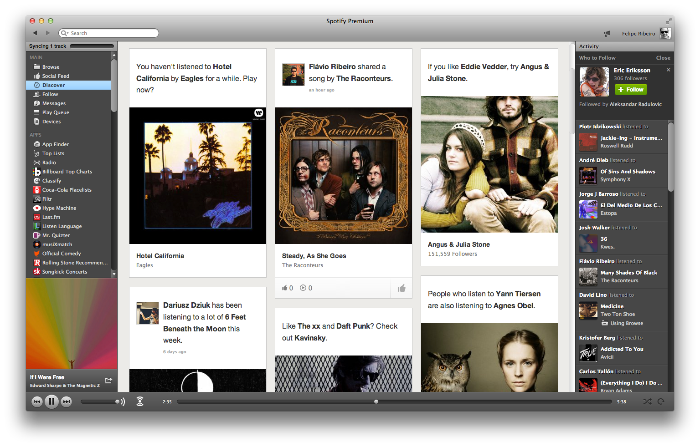
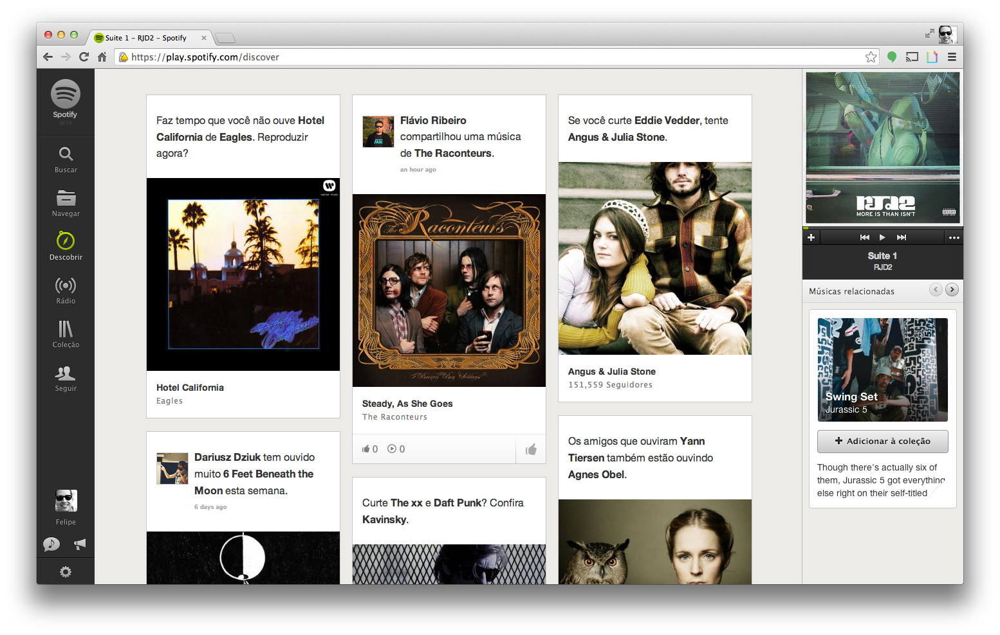
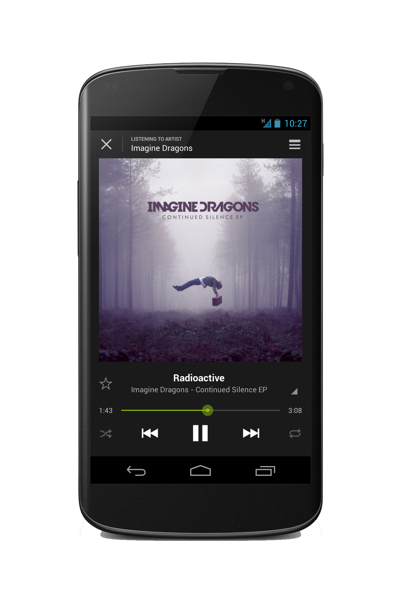
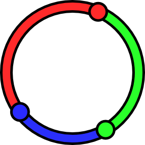

layout: true
class: center, middle, inverse
---
# De um a um milhão de usuários - o caminho para a escalabilidade
.footnote[[felipe@spotify.com](mailto:felipe@spotify.com) - [@felipernb](http://twitter.com/felipernb)]
---
layout: false
.left-column[
  ## About Me
]
.right-column[
  # Felipe Ribeiro
- Formado em Ciência da Computação pela UFCG

- Engenheiro de Software na Spotify em Estocolmo, Suécia
]
---
class: inverse, center, middle, spotify

---
name: screenshot-desktop
class: screenshot, center, middle

---
name: screenshot-web
class: screenshot, center, middle

---
class: mobile, center, middle


---
name: video
class: inverse, center, middle, video
<video src="connect.mp4" controls>
---
name: numeros
class: inverse, middle
style: backgound-size: cover;
## Números

- Disponível em 32 países
- Mais de 24 milhões de usuários
- Cerca de 6 milhões pagam pelo serviço
- Mais de 20 milhões de músicas disponíveis
- 20 mil músicas são adicionadas a cada dia
- Mais de 1 BILHÃO de playlists
- 4 datacenters com mais de 6000 servidores
- ~500 devs divididos em 4 sedes: Stockholm, New York, Gothenburg e San Francisco

---
class: inverse, center, middle
## Escalabilidade
---
class: inverse, middle
## O que NÃO é escalabilidade?
- Não é performance (2GHz vs. 3GHz)

- Não é linguagem de programação (Java vs. PHP vs. Ruby)

- Não é arquitetura de hardware (AMD vs. Intel)

---
class: inverse, middle
## O que é escalabilidade?
### _É a capacidade de suportar um aumento de carga sem degradar a performance_

---
class: inverse, center, middle
## Performance vs. Escalabilidade
---
name: performance
class: inverse, center, middle
## Performance

---
name: escalabilidade
class: inverse, center, middle
## Escalabilidade

---
class: inverse, center, middle
## Web é um dos mercados com menor barreira de entrada
???
- Qualquer um pode colocar um site em produção, e o que acontece se ele faz sucesso?

---
class: inverse, center, middle
## Problemas de escalabilidade são problemas bons.

???
- Normalmente significam que o modelo de negócio tem futuro
---
class: inverse, center, middle
## Dinheiro resolve (alguns) problemas.
???
- As vezes a solução mais barata é jogar dinheiro no problema e escalar verticalmente, ou deixar que alguém escale para você.

---
class: inverse, middle, shared
## Hospedagem compartilhada
### Pros
- Comodidade

- "One-click install"

- Baixo custo de operações

- Arquitetura simples e desenvolvimento rápido

???

Um servidor - muitos sites
---
class: inverse, middle, shared
## Hospedagem compartilhada
### Contras

- Todos os recursos são compartilhados

- Performance afetada pelos outros sites

- Suporta algumas (poucas) centenas de usuários

- Sem redundância

---
class: inverse, middle, center, cloud
## VPS ou Cloud - Ambientes virtualizados
---
class: inverse, middle, cloud

## Se sua arquitetura não foi pensada para escalar, tudo o que pode ser feito é criar uma instância com maior capacidade (escalar verticalmente).


???
- Um servidor, um site
- A física tem limites
- Maior controle
- Banco e web server na mesma máquina

---
class: inverse, middle, center
## Repensando a arquitetura - Complexidade necessária

---
class: inverse, middle, center, cloud2
## Separar servidor web do banco de dados

???
- A primeira atitude mais óbvia

- Um site - vários servidores

- Overhead de rede

- Em compensação, você pode escalar as camadas separadamente

---
class: inverse, middle, center, cache
## Caching
---
class: inverse, middle
## Caching

- Key-value mais rápido que consulta SQL

- Memória é mais rápido que disco

- LRU

- Lembre-se de invalidar o cache na escrita

???

- Memcached server: Memória
- Complexidade no código
---
class: inverse, middle, center
## _"There are only two hard things in Computer Science: cache invalidation, naming things and off-by-one errors"_

---
class: inverse, middle, center
## Cache negativo
---
class: inverse, middle

```php
$value = $mc->get($key);
if (!$value) {
	$value = $db->get("SELECT ...");
	$mc->set($key, $value ?: NEGATIVE_CACHE);
}

return $value != NEGATIVE_CACHE ? $value : null;
```

---

class: inverse, middle, center

## SPOF - Single point of failure

---
class: inverse, middle
## Analisar e remover SPOFs
- Se um servidor sai do ar, a sua aplicação continua funcionando? Se a resposta é NÃO, você achou um SPOF

- Nessa arquitetura, existem dois SPOFs óbvios - o servidor de banco de dados e o servidor web. Se algum dos dois cair, a aplicação não pode funcionar normalmente

---
class: inverse, middle, shared-nothing
## Shared nothing architecture

---
class: inverse, middle
## Shared nothing architecture
- Se você não guarda estado no servidor, é fácil substituir um servidor web que falha

- Gerenciamento de sessões precisa mudar

- O SPOF passa a ser o DNS, que vai apontar para um só servidor.


---
class: inverse, middle, lb
## Load Balancer

---
class: inverse, middle
## Load Balancer

- HAProxy

- nginx

- Amazon Web Services Elastic Load Balancer

---
class: inverse, middle, replication

## Removendo o SPOF do banco de dados
---
class: inverse, middle

## Removendo o SPOF do banco de dados
- Replicação

- Sharding

???

- Replicação master-master vs master-slave
- Sharding depende do modelo de negócio
- Algumas soluções NoSQL cuidam disso out-of-the-box

---
class: inverse, middle, cachefarm
## Cache farm

---
class: inverse, middle, center
## Consistent Hashing

---
class: inverse, middle

```php
$mc = new \Memcached();
$mc->setOption(\Memcached::OPT_DISTRIBUTION,
	\Memcached::DISTRIBUTION_CONSISTENT);

foreach ($servers as $server) {
	$mc->addServer($server['host'],
		$server['port'],
		$server['weight']);
}
```

---
class: inverse, middle, center

## CDN

Mais rápido para o usuário e diminui muito o tráfico na sua rede

---
class: inverse, middle, center

## Arquitetura orientada a serviços

A camada web pode falar com serviços que cuidam do back-end

---
class: inverse, middle, center

## Ferramenta certa para o problema

---
class: inverse, middle
## Busca Textual
- Solr

- ElasticSearch
---
class: inverse, middle

## Caching
- Memcached

- Redis
---
class: inverse, middle

## Filas
É fácil escalar sites onde o usuário não gera conteúdo, mas caso contrário, as ações precisam ser enfileiradas

- Gearman

- RabbitMQ

- Redis

- Amazon Simple Queue Service

---
class: inverse, middle, center

## Ser rápido vs. parecer rápido
Usuário envia conteúdo e quer ver imediatamente na página.

---
class: inverse, middle

## Infraestrutura própria
- Quando você chega a uma escala de centenas/milhares de servidores, você vai poder bancar sua própria infra-estrutura.

- Maior controle (Hardware próprio)

- Maior responsabilidade

???

- Múltiplos DCs
- Deploys mais complexos

---
class: inverse, middle, center
## Mudanças na cultura
---
class: inverse, middle, center
## Equipes mais independentes usando as stacks apropriadas para suas features

---
class: inverse, middle
## Meça primeiro, mude depois
_"Premature optimization is the root of all evil" - D. Knuth_

---
class: inverse, middle, center

## Monitoramento
---
class: inverse, middle, center
## Deployment
---
name: last-page
template: inverse
class: inverse, center, middle

## That's all folks!

[felipe@spotify.com](mailto:felipe@spotify.com)

[@felipernb](http://twitter.com/felipernb)


